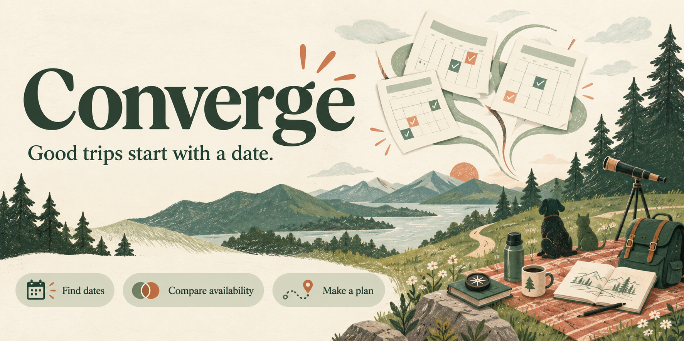

<p align="center"></p>

# Converge

**Make time for a trip together.** Find a few good dates, ask your people, and choose the one that works best.

Converge takes a group trip from “we should do that” to a shared plan. Browse dates, optionally check calendars, send one response link, and compare everyone's answers in one place. No spreadsheet archaeology or scrolling back through the group chat.

> **Start here:** Download the app, open its Start file, and try the complete product with invented people and calendars. No accounts, keys, payments or AI subscription. Your local plans survive closing and reopening the app. The first installation needs an internet connection; the demo itself runs on your computer.

I built this for myself and my own trips. This public version keeps the way I designed it, with entirely invented examples. Make it your own, and feel free to improve mine. Hopefully it gives you a useful starting point, or at least some ideas. Cheers!

## Try it, even if you have never used GitHub

1. Install the **LTS version of [Node.js](https://nodejs.org/en/download)**. It is the software that runs this app. Use its standard installer, then close and reopen any terminal windows. Converge needs Node 22 or newer.
2. [Download Converge](https://github.com/jessecmaddox3/converge-planner/releases/latest). Under **Assets**, choose the file named `converge-planner-1.0.0.zip`.
3. Unzip it into a folder you want to keep. On Windows, choose **Extract All** first. Do not run it inside the ZIP preview.
4. Open **Start.command** on a Mac or **Start.cmd** on Windows. On Linux, open a terminal in the extracted folder and run `bash start.sh`.
5. A terminal window downloads the dependencies, builds the app and opens your browser. Leave that window open while using Converge. The first start can take a few minutes.

If your Mac will not open Start.command, open Terminal, type `bash ` (including the space), drag Start.command into that window, and press Return. You can also use the terminal instructions below. More help: [getting started](docs/GETTING_STARTED.md).

At the top of the app, **Try it as** switches among four fictional people. Open **Example trips and outbox**, start with the Orchard sketching weekend, and try organizer and invitee views. “Anonymous visitor” lets you try a private response link without an account. Confirmation emails go to a **local preview outbox**; nothing is sent.

To stop, select the terminal window and press **Control+C**. Open Start again to return to your saved plans.

### Comfortable with a terminal?

```sh
git clone https://github.com/jessecmaddox3/converge-planner.git
cd converge-planner
npm ci
npm run build
npm run demo
```

Open <http://127.0.0.1:5075>. The desktop Start files perform these steps and reuse an unchanged installation/build.

## What you get

- **Flexible date planning:** weekends, single days, full weeks or custom lengths, exact date ranges, month browsing, alternative starts and a saved shortlist.
- **Optional calendar checks:** multiple calendars, timezone-aware event normalization, partial coverage, clashes and travel-adjacent conflicts. Ranking is deterministic and does not call AI.
- **Useful history:** compare equivalent periods in previous years; optionally group related historical events with Gemini. The local demo shows an explicitly labeled simulation.
- **A simple response link:** Available, Maybe, Cannot, or unanswered for each proposed date, plus favorites. Anonymous respondents receive a private return link; signed-in respondents can return through My Trips.
- **A group decision view:** side-by-side availability, required people, an expected-person roster, unanswered responses and favorite tie-breaks. Your private roster and contact addresses stay out of the shared view.
- **Confirmation and recovery:** review the chosen date, download a calendar file, queue optional confirmation emails, reopen availability and confirm a later version. Delivery jobs, retries and application data use durable storage.

Calendar details stay with the person checking them. Others see shared availability, not event titles. A shared trip link does reveal the trip and participants' names and answers. Treat it as something to share with your group.

## Use it with your own group

The local demo is a fictional sandbox on one computer. For real sign-in and links your friends can open, run your own hosted installation with Google OAuth and Supabase. Calendar connection and email delivery are optional; AI grouping is separately opt-in.

[Hosting instructions](docs/HOSTING.md) cover the empty-database setup, your own configuration, HTTPS, backups and the maintenance scheduler. Hosting is a separate setup task and can incur provider costs. There is no shared Converge service or account created by this download.

## How it is designed

The full Next.js/React app is included, alongside its scheduling engine, SQL migrations, anonymous response capabilities, calendar integration, durable notification worker and tests. The local mode runs the same SQL lifecycle in an embedded PostgreSQL database. Hosted requests use Supabase. Synthetic calendars replace provider transports without replacing the planner.

[Architecture and design choices](docs/ARCHITECTURE.md) · [Development and verification](docs/DEVELOPMENT.md) · [Backup and upgrade](docs/BACKUPS.md)

Using an AI assistant? Ask it to read the included [trip-planning skill](skills/plan-converge-trip/SKILL.md). It explains the setup, planning workflow and design constraints so you can build on the project without rediscovering them.

Converge proposes dates. It does not book travel, check guests into an event or write directly to Google Calendar. Import the downloaded calendar file yourself. Calendar inference and optional AI grouping can be wrong; review the underlying events. Email has an at-least-once delivery contract, so a retry after an ambiguous provider failure can produce a duplicate.

## Make it yours

Use it, change it, redistribute it or build something commercial with it under the [MIT license](LICENSE). Keep the license notice. Bundled fonts retain their own [open font licenses and attribution](THIRD_PARTY_NOTICES.md).

Ideas for improvements: more calendar providers, clearer accessible comparisons for large groups, localization, and better explanations for travel conflicts. [Contributions are welcome](CONTRIBUTING.md). Please use invented examples in issues and pull requests. Report security problems [privately](SECURITY.md).
